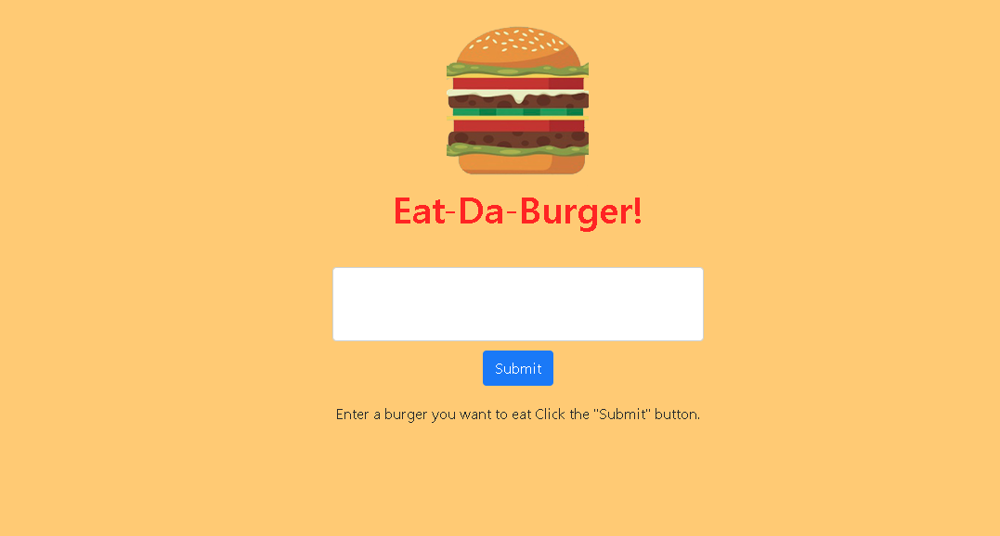

# sequelizedBurger

### Overview

 Full-stack burger logging Application created with Node, Express, and Sequelize; hosted on Heroku

### Technologies Used

Node.js, Express.js, JavaScript, JQuery, Sequelize, MySQL, and Heroku

### Live Site 

   * Live application at [Heroku](https://ancient-everglades-50684.herokuapp.com/)
   * Enter a burger in the text box in the middle of the page and click Submit.
   * Your burger will be displayed on the left of the page.
   * Click the "Devour It" button to "eat" the burger.  Burger will then display in "Devoured" column on right of page.